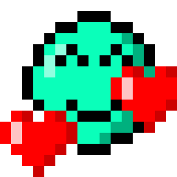

# MBTI

### ( Movie By Team gogI )

## 팀원 정보 및 업무 분담 내역

- 황태희 : 백엔드 담당
  - Django REST Framework, Movie DB를 이용한 Data 및 App 구현

- 김우창 : 백엔드 보조 , 프론트엔드 담당
  - Django App 추가 구현 및 Vue.js, Bootstrap-vue 활용한 디자인

- 이종훈 : 프론트엔드 담당
  - CSS, Bootstrap4, Vue.js 및 핵심적인 UI 구현 + PPT 제작

## 목표 서비스 구현 및 실제 구현 정도

### 0. 개발 도구

        

1학기 내 배운 모든 스택, 스킬 사용

##### 메인 페이지

### 1. 영화

- 영화 목록, pagination

- Movie_detail

- Review, 평점 기능

### 2. 커뮤니티

- 게시글 작성

- 게시글 세부정보

### 3. 프로필

- 팔로우 기능

- Cards integration

### 4. 회원가입, 로그인

- 회원가입

- 로그인

## 데이터베이스 모델링(ERD)

## 프로젝트 진행 과정 중 특이사항

- 관심도가 높고 이목을 끌기 쉬운 MBTI를 핵심 기능으로 둠
- 조원 3명이 MBTI에 해당하는 글자 8개가 모두 있어 데이터 기반으로 영화 만들기 수월했음.
- 메인 페이지에 gif 파일을 두어 흥미 유발
- 인증 권한 - 로그인 한 사람만 게시글, 댓글을 작성할 수 있게 수정
- bootstrap-vue 의 b-card를 사용하여 반응형 이미지 설정

### 느낀점

- 김우창

  - 이전의 당일 프로젝트를 모두 혼합하여 만드는 장기 프로젝트여서 쉬운듯 어려운듯 여러 가지 느낌이 교차했습니다. 다른 조와 달리 3인이고,  같이 합숙하며 프로젝트를 진행해서 수월할 줄 알았지만, 생각보다 부족한 시간 + 욕심이 생겨서 더 많은 구현을 하려다가 시간적 손해를 많이 봐서 아쉬웠습니다.

    프로젝트 진행 중 저희 조원 뿐만 아니라, 다른 조 친구들과도 교류하며 어떤 식으로 페이지를 만들고 꾸밀 지 의논을 많이 했습니다. 그 과정에서 제가 어떠한 기술 스택에 강점이 있고, 부족한 점이 있는지 깨닫게 되었습니다.

- 이종훈

 집에 근 일주일 두 명을 숙박시키고, 작업할 환경까지 마련하느라 저는 프로젝트 준비를 되게 오래 전 부터 했는데요, 시작 하고 나니 정말 후회없이 보람찬 기억들  뿐이라 너무 좋았습니다! 그리고 프로젝트 기간에 오히려 더 많은 반 학우들을 만날 수 있어서 좋았어요. 
 처음에는 작업 스코프를 정해놓고 시작했지만, 샌드박스처럼 도구를 이것 저것 모으다보니 할 수 있는것들이 생각나서, 아쉬워서 정말 다 만들어 보기로 했던 것 같아요. 저는 초기 기획보다 더 나은 결과물이 나와서 좋았습니다.
 프론트엔드 작업을 주로 했지만 태희와 소통하면서 나 이거 필요해 라고 말하면 백엔드에서 도구를 뚝딱뚝딱 만들어서 쥐어주던 든든한 모습이 기억에 남습니다. 그리고 정보의 흐름이라는 것을 느끼게 되어서 그 어떤 공부보다 도움이 많이 되었습니다.
 세명이 동시에 작업하면서도 깃에서 충돌이 한번도 없었던 것이 놀라웠는데, 그 만큼 의사소통이 프로젝트에 주효한 영향을 미치는 것 같습니다. 다음에도 프로젝트 (6인)을 하더라도 한 곳에 모여서 진행할 수 있으면 좋을 것 같아요

- 황태희

  - 그 동안 배웠던 모든 것들을 총 정리 한다는 느낌의 프로젝트 였던 것 같습니다. 다른 팀원들과 같은 장소에서 함께 작업할 수 있었던 프로젝트여서 정말 좋은 경험이었습니다. 협업이란 어떻게 해야되는 것인지에 대해 미리 겪어볼 수 있었고, 정말 즐거웠던 일주일이었습니다.
  - 아쉬웠던 점은 UI와 UX 에 대한 고려가 부족했다는 점입니다. 주어진 기간동안 많은 기능의 구현에만 집중하느라, 정작 중요한 부분은 놓치게 되었던 것 같습니다. 우리가 제공하는 서비스가 사용자를 사로잡기 위해서는 그 기능도 중요하지만, 사용자가 어떻게 접근할 수 있는가에 대한 고민도 충분히 해야겠다는 배움을 얻었습니다.
  - 이번 프로젝트를 통해 drf 와 vue.js 로 이루어진 서버를 제작하며, db의 데이터를 어떻게 사용자에게 제공 할 수 있는지 경험하게 되었습니다. 같은 데이터여도 제공하는 방식에 따라 사용자가 경험하는 것은 완전히 달라지게 되었습니다. 양질의 데이터를 구성하는 것과 동시에, 이를 사용자에게 전달하는 방법에 대한 고민이 충분히 이루어져야만 좋은 서비스를 만들 수 있다는 생각을 하게 되었습니다.
